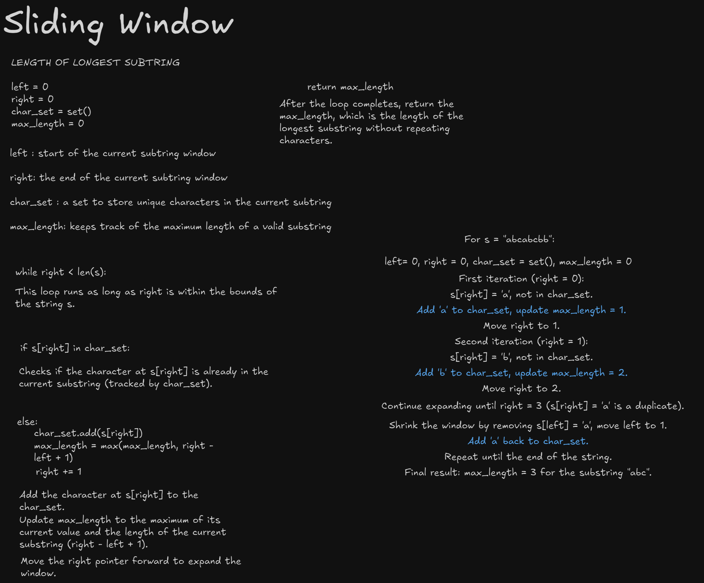

# Longest Substring Without Repeating Characters

This project implements a solution to the classic problem of finding the length of the longest substring without repeating characters in a given string. It uses the sliding window technique to achieve an efficient solution.

## Problem Statement
Given a string `s`, find the length of the longest substring without repeating characters.

### Example Inputs and Outputs

#### Example 1:
- **Input**: `s = "abcabcbb"`
- **Output**: `3`
- **Explanation**: The answer is "abc", with a length of 3.

#### Example 2:
- **Input**: `s = "bbbbb"`
- **Output**: `1`
- **Explanation**: The answer is "b", with a length of 1.

#### Example 3:
- **Input**: `s = "pwwkew"`
- **Output**: `3`
- **Explanation**: The answer is "wke", with a length of 3. Note that the answer must be a substring, "pwke" is not valid.

## Approach
The solution uses the **sliding window technique** to efficiently track the longest substring without repeating characters. A set is used to keep track of the characters in the current substring, and two pointers (`left` and `right`) define the boundaries of the window.

### Steps:
1. Initialize two pointers, `left` and `right`, both starting at the beginning of the string.
2. Use a set to store characters in the current substring.
3. Expand the `right` pointer to include new characters.
4. If a duplicate character is found, move the `left` pointer forward to remove duplicates.
5. Keep track of the maximum length of the substring encountered.

## Code
```python
def lengthOfLongestSubstring(s: str) -> int:
    left = 0
    right = 0
    char_set = set()
    max_length = 0

    while right < len(s):
        if s[right] in char_set:
            char_set.remove(s[left])
            left += 1
        else:
            char_set.add(s[right])
            max_length = max(max_length, right - left + 1)
            right += 1

    return max_length
```

## Complexity Analysis
- **Time Complexity**: `O(n)`
  - Each character is visited at most twice (once when expanding `right` and once when shrinking `left`).
- **Space Complexity**: `O(k)`
  - `k` is the size of the character set (e.g., 26 for lowercase English letters).

## How to Use
1. Copy the code into a Python script or an IDE.
2. Call the function `lengthOfLongestSubstring(s)` with a string `s` as the argument.
3. The function will return the length of the longest substring without repeating characters.

### Example Usage
```python
print(lengthOfLongestSubstring("abcabcbb"))  # Output: 3
print(lengthOfLongestSubstring("bbbbb"))     # Output: 1
print(lengthOfLongestSubstring("pwwkew"))    # Output: 3
```

## Key Learnings
- The sliding window technique is an efficient way to solve substring problems.
- Using sets or dictionaries can help track unique elements efficiently.
- Optimizing the window size dynamically avoids unnecessary computations.

